# Mermaid Beauty

Give Mermaid diagrams in Obsidian a consistent appearance: soft colors, rounded rectangular nodes, readable labels, and ELK layouts for relationship diagrams. Every supported diagram type is enhanced by default. Each type can inherit the defaults, use its own appearance, or use Obsidian's existing renderer.

[中文说明](README.zh-CN.md)



## Features

- Four palettes — Mint, Slate, Sky, and Rose — with light and dark variants.
- Controls for font size, rectangular corner radius, graph spacing, layout, and fitting diagrams to the note width.
- Per-type JSON options for Mermaid colors and diagram settings.
- The complete Mermaid 12.0.0 engine, including ELK, plus ZenUML, bundled locally.
- Existing `mermaid` code blocks remain editable. No conversion or special fence syntax is needed.
- If enhanced rendering fails, the plugin tries the renderer that was active before it. Disabling the plugin restores that renderer.

The Mint palette and flowchart treatment are inspired by the diagrams shown in Codex. Rendering uses public Mermaid libraries and an independent theme. Layouts and typography can differ across applications and fonts.

## Install

Requires Obsidian 1.12.7 or later.

Until the plugin is listed in the community directory, install it manually:

1. Download `main.js`, `manifest.json`, and `styles.css` from a [GitHub release](https://github.com/theChildinus/mermaid-beauty/releases).
2. Place them in `<vault>/.obsidian/plugins/mermaid-beauty/`.
3. Reload Obsidian, open **Settings → Community plugins**, and enable **Mermaid Beauty**.
4. Disable other plugins that replace Mermaid's renderer to avoid competing settings.

To build from source, run `npm ci` and `npm run build`, then copy the same three files. Use Node.js 24.12 or later for development.

## Configure

Open **Settings → Mermaid Beauty**. The defaults apply to all diagram types. Under **Diagram types**, choose a type and a renderer:

| Setting | Result |
| --- | --- |
| Inherit defaults | Use enhanced rendering with the global appearance. |
| Enhanced, with custom appearance | Override appearance and Mermaid options for this type. |
| Existing renderer | Leave this type to Obsidian or the preceding renderer. |

For example, select **Sequence**, choose a custom appearance, and apply:

```json
{
  "themeVariables": {
    "actorBkg": "#e1effc",
    "actorTextColor": "#225c95"
  },
  "sequence": {
    "actorMargin": 80,
    "messageMargin": 40
  }
}
```

Custom options accept `themeVariables` and diagram-specific configuration sections. Security settings, arbitrary JavaScript, and CSS injection are excluded. Diagram frontmatter and explicit node styles take precedence for the properties they specify.

The command palette includes **Mermaid Beauty: Refresh diagrams** and **Mermaid Beauty: Toggle enhanced rendering**. Reading view refreshes immediately. If Live Preview or another plugin caches a rendered diagram, switch reading/editing mode or reopen the note after changing settings.

## Diagram coverage

All diagram families in the bundled engine are enabled by default:

- Flowchart, sequence, class, state, entity relationship, requirement, use case, agent flow, swimlane, and C4.
- Gantt, pie, XY chart, quadrant, radar, Sankey, treemap, and Venn.
- Mind map, timeline, user journey, Git graph, block, packet, architecture, and Kanban.
- Event modeling, Ishikawa, Wardley, Cynefin, tree view, railroad (IR, EBNF, ABNF, PEG), ZenUML, and version info.

Relationship diagrams that support interchangeable graph layouts use ELK by default; Dagre is also available. Other diagrams keep their specialized layout. Each renderer exposes different styling options, so controls such as corner radius and graph spacing only affect applicable elements. Semantic shapes, including decision diamonds and database cylinders, are preserved.

Flowchart cards fit their text and reserve vertical space. Labels are measured with their capsule padding before layout, and orthogonal routes use wider, bounded corner rounding. Advanced flowchart options accept `elk` settings, including node placement alignment.

Coverage is tied to the bundled Mermaid version. New upstream diagram types require a plugin update. Unrecognized declarations are attempted with the bundled engine, then handed to the existing renderer if they fail.

## Privacy and compatibility

Rendering happens locally. The plugin does not read unrelated notes, send diagram source to a service, collect telemetry, or download renderer code. Images or links explicitly included in a diagram follow Mermaid and Obsidian behavior; offline rendering of external images requires those resources to be available. Unregistered third-party icon packs are not downloaded automatically.

The production code uses browser APIs and Obsidian's API, without Node.js or Electron calls. Mobile behavior still needs device testing. Large diagrams and the bundled engine increase memory use; limits are 100,000 source characters and 1,500 graph edges. Unsupported or invalid diagrams may also fail in the existing renderer.

The plugin wraps `loadMermaid().render`. That function is used by Obsidian's current Markdown renderer, but changes in Obsidian or another renderer plugin can affect integration.

## Development

```sh
npm ci
npm run check
npm run dev:preview
```

Open `http://127.0.0.1:4173`, press **Run rendering checks**, then run:

```sh
npm run test:render
```

The preview uses the production rendering module. It checks every listed family in light and dark modes, per-type isolation, native opt-outs, error recovery, markup sanitization, unload behavior, and narrow containers. `test:render` verifies that the saved browser report matches the current source. It does not substitute for testing inside Obsidian.

Report bugs with your Obsidian version, plugin version, diagram type, and a minimal example that contains no private information.

The pinned Mermaid bundle has a small, checked build patch for flowchart label measurement in `scripts/mermaid-layout-patch.mjs`. It changes only the enhanced flowchart layout; dependency files on disk stay untouched. Review this patch and the bundled ELK import when upgrading Mermaid.

## License

[MIT](LICENSE). Mermaid and the other bundled libraries retain their own licenses; see [third-party notices](THIRD_PARTY_LICENSES.md).
