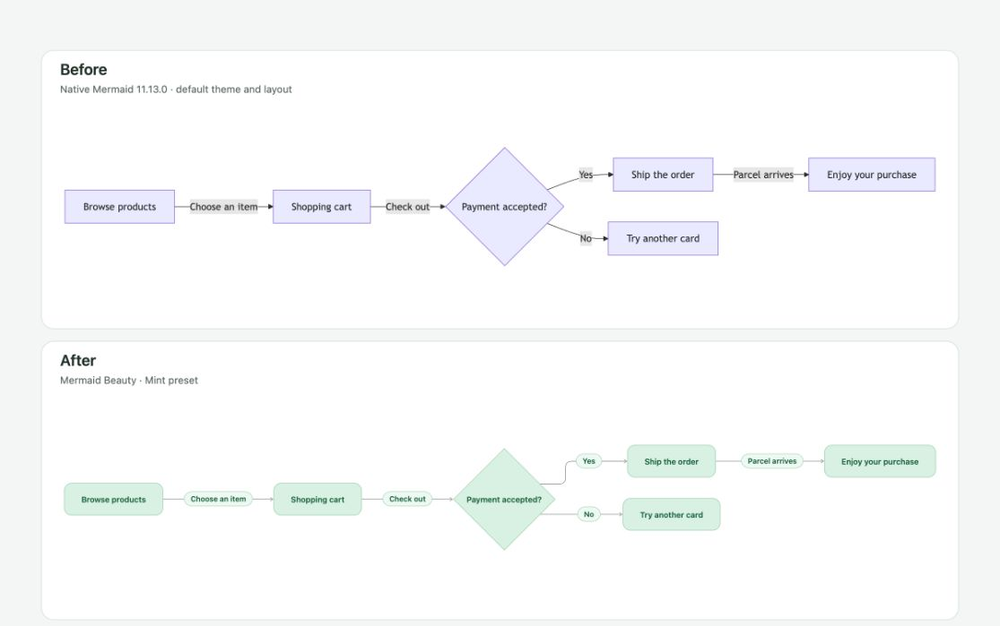
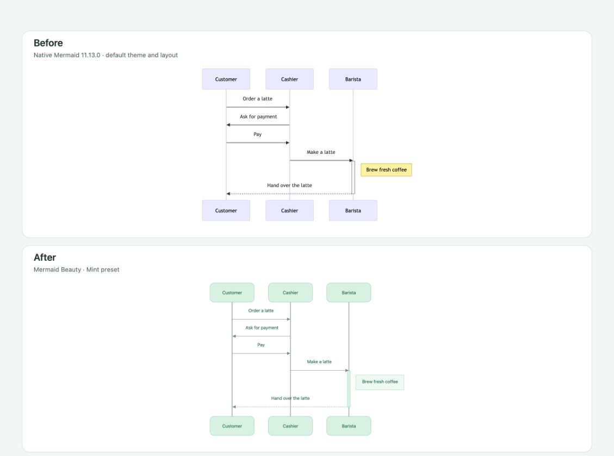
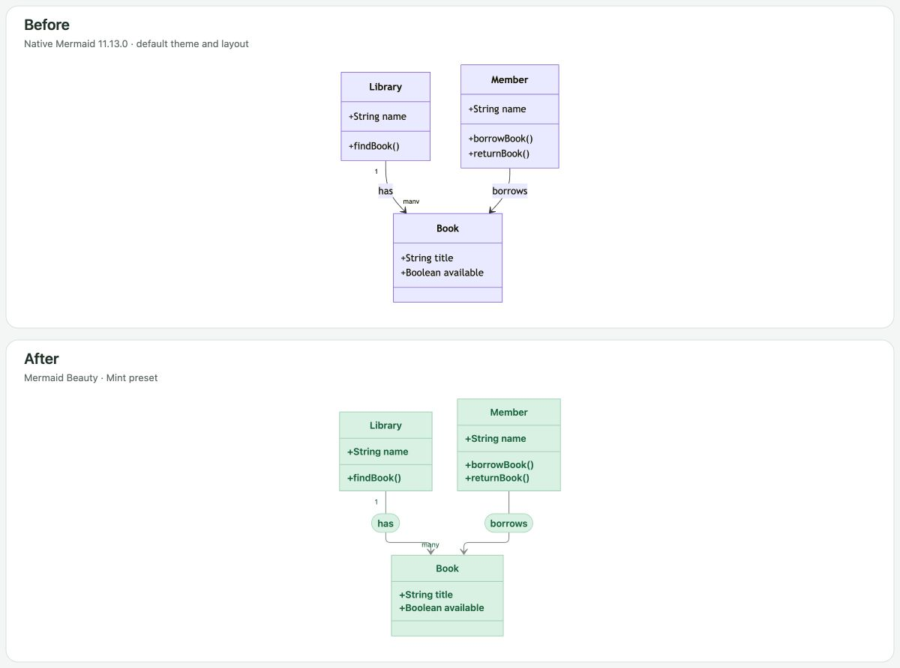

# Mermaid Beauty

Give Mermaid diagrams in Obsidian a consistent appearance: soft colors, rounded rectangular nodes, readable labels, and ELK layouts for relationship diagrams. Every supported diagram type is enhanced by default. Each type can inherit the defaults, use its own appearance, or use Obsidian's existing renderer.

[中文说明](README.zh-CN.md)

## Before and after

Each pair uses exactly the same English Mermaid source. **Before** is native Mermaid 11.13.0, the version bundled with Obsidian 1.13.7, with its default theme, Dagre layout, fonts, and labels. It runs separately without the plugin. **After** is Mermaid Beauty with the Mint preset. Your Obsidian theme may change the native colors.

### Online shopping

Browse products, pay, and receive an order. The flowchart branches when payment succeeds or a card is declined.



### Ordering coffee

A customer orders a latte, pays the cashier, and receives a drink from the barista.



### Library books

A library has books, and members borrow them. The class diagram keeps the same fields and relationships.



[Example sources](tests/browser/readme-sources.ts)

## Features

- Custom colors for background, nodes, labels, text, borders, connectors, and accents, with separate light and dark settings. Mint, Slate, Sky, and Rose presets provide starting points.
- Controls for font size, rectangular corner radius, graph spacing, connector width, layout, and fitting diagrams to the note width.
- Chinese and English settings, commands, and notices. The interface follows Obsidian by default; you can choose either language explicitly.
- Per-type JSON options for Mermaid colors and diagram settings.
- The complete Mermaid 12.0.0 engine, including ELK, plus ZenUML, bundled locally.
- Existing `mermaid` code blocks remain editable. No conversion or special fence syntax is needed.
- If enhanced rendering fails, the plugin tries the renderer that was active before it. Disabling the plugin restores that renderer.

The Mint palette and flowchart treatment are inspired by the diagrams shown in Codex. Rendering uses public Mermaid libraries and an independent theme. Layouts and typography can differ across applications and fonts.

## Install

Requires Obsidian 1.12.7 or later.

Install from the [community directory](https://community.obsidian.md/plugins/mermaid-beauty), or install manually:

1. Download `main.js`, `manifest.json`, and `styles.css` from a [GitHub release](https://github.com/theChildinus/mermaid-beauty/releases).
2. Place them in `<vault>/.obsidian/plugins/mermaid-beauty/`.
3. Reload Obsidian, open **Settings → Community plugins**, and enable **Mermaid Beauty**.
4. Disable other plugins that replace Mermaid's renderer to avoid competing settings.

To build from source, run `npm ci` and `npm run build`, then copy the same three files. Use Node.js 24.12 or later for development.

The complete offline renderer makes `main.js` about 5.9 MB. It exceeds Obsidian Sync Standard's 5 MB per-file limit, so that plan cannot sync this file. Install the plugin separately on each device.

## Configure

Open **Settings → Mermaid Beauty**. **Language** offers **Follow Obsidian**, **中文**, and **English**. It changes the plugin interface immediately and keeps diagram source and labels unchanged. Unsupported Obsidian languages fall back to English.

Under **Color palette**, select **Mint**, **Slate**, **Sky**, or **Rose** to apply a ready-made scheme. Each option shows its colors before you select it.

All four presets use stronger text, distinct connectors and outlines, and soft fills in both light and dark modes. Sequence numbers, in-bar Gantt labels, pie values, and Git branch labels adapt to their fill when needed for readability. Explicit text colors in advanced options or diagram source remain authoritative.

Choose **Custom** to open the light and dark color editors, then use the color pickers or enter hex colors such as `#26845b`. Rendering follows Obsidian's current theme. Switching to a preset keeps your custom colors saved; select **Custom** again to restore them. **Reset colors** clears saved custom colors for the current appearance and returns to its preset.

| Appearance control | Meaning |
| --- | --- |
| Font size | Text size in pixels. |
| Corner radius | Rounding of supported rectangular nodes; diamonds and database shapes retain their meaning. |
| Graph spacing | Space between nodes and ranks, where the layout supports it. |
| Line width | Connector thickness in pixels. Default: 1.1 px; range: 0.5–6 px. |

**Line width** can be set globally or per type. Saved zero or invalid values now use the positive default; a zero per-type override inherits the global width. Valid saved widths are retained. It applies to connections in flowcharts, sequences, class/state/ER/requirement diagrams, mind maps, user journeys, Git, C4, block/architecture diagrams, railroad/tree/swimlane/use-case/agent-flow diagrams, event modeling, fishbone/Wardley diagrams, and ZenUML. Node borders, chart axes, timeline axes, and Sankey bands retain their widths. Thick edges remain twice the selected width, invisible and dashed edges retain their meaning, and explicit inline edge styles take precedence. A type without adjustable connections does not show this control.

The defaults apply to all diagram types. Under **Diagram types**, choose a type and a renderer:

| Setting | Result |
| --- | --- |
| Inherit defaults | Use enhanced rendering with the global appearance. |
| Enhanced, with custom appearance | Override appearance and Mermaid options for this type. |
| Existing renderer | Leave this type to Obsidian or the preceding renderer. |

A type can override individual colors while inheriting the remaining global colors. Choosing a preset for that type gives it its own palette. Advanced JSON and diagram source settings take precedence over the color controls.

For example, select **Sequence**, choose a custom appearance, and apply:

```json
{
  "themeVariables": {
    "actorBkg": "#e1effc",
    "actorTextColor": "#225c95"
  },
  "sequence": {
    "actorMargin": 80,
    "messageMargin": 40
  }
}
```

Custom options accept `themeVariables` and diagram-specific configuration sections. Security settings, arbitrary JavaScript, and CSS injection are excluded. Diagram frontmatter and explicit node styles take precedence for the properties they specify.

The command palette includes **Mermaid Beauty: Refresh diagrams** and **Mermaid Beauty: Toggle enhanced rendering**. Reading view refreshes immediately. If Live Preview or another plugin caches a rendered diagram, switch reading/editing mode or reopen the note after changing settings.

## Diagram coverage

All diagram families in the bundled engine are enabled by default:

- Flowchart, sequence, class, state, entity relationship, requirement, use case, agent flow, swimlane, and C4.
- Gantt, pie, XY chart, quadrant, radar, Sankey, treemap, and Venn.
- Mind map, timeline, user journey, Git graph, block, packet, architecture, and Kanban.
- Event modeling, Ishikawa, Wardley, Cynefin, tree view, railroad (IR, EBNF, ABNF, PEG), ZenUML, and version info.

Relationship diagrams that support interchangeable graph layouts use ELK by default; Dagre is also available. Other diagrams keep their specialized layout. Each renderer exposes different styling options, so controls such as corner radius and graph spacing only affect applicable elements. Semantic shapes, including decision diamonds and database cylinders, are preserved.

Flowchart cards fit their text and reserve vertical space. Labels are measured with their capsule padding before layout, and orthogonal routes use wider, bounded corner rounding. Advanced flowchart options accept `elk` settings, including node placement alignment.

All four palettes provide explicit light/dark colors for chart series, axes, groups, and labels. Filled node labels choose a readable foreground when only the background is customized; explicit text colors remain authoritative. SVG node labels are centered from their measured bounds before layout, including circle and ellipse shapes. Sankey bands retain their values and gradients without a darkening blend mode.

Kanban columns and cards use separate fills and visible outlines. Headers and task text share a left inset, columns keep a common height, and long ticket/assignee labels move onto separate rows. Card corners are capped at 8 px to retain a rectangular shape. Explicit source colors, ticket links, and priority colors are preserved.

Coverage is tied to the bundled Mermaid version. New upstream diagram types require a plugin update. Unrecognized declarations are attempted with the bundled engine, then handed to the existing renderer if they fail.

## Privacy and compatibility

Rendering happens locally. The plugin does not read unrelated notes, send diagram source to a service, collect telemetry, or download renderer code. Images or links explicitly included in a diagram follow Mermaid and Obsidian behavior; offline rendering of external images requires those resources to be available. Unregistered third-party icon packs are not downloaded automatically.

The production code uses browser APIs and Obsidian's API, without Node.js or Electron calls. Mobile behavior still needs device testing. Large diagrams and the bundled engine increase memory use; limits are 100,000 source characters and 1,500 graph edges. Unsupported or invalid diagrams may also fail in the existing renderer.

The plugin wraps `loadMermaid().render`. That function is used by Obsidian's current Markdown renderer, but changes in Obsidian or another renderer plugin can affect integration.

Enhanced sequence diagrams retain their natural dimensions and proportional strokes in Mermaid Zoom's fullscreen view. This compatibility styling applies only to those fullscreen copies; inline diagrams and other diagram types keep their existing behavior.

## Development

```sh
npm ci
npm run check
npm run dev:preview
```

Open `http://127.0.0.1:4173`, press **Run rendering checks**, then run:

```sh
npm run test:render
```

Use **Export README comparisons** on the preview page to render `tests/browser/readme-sources.ts` and save the comparison SVGs. Open `/comparison/flowchart`, `/comparison/sequence`, or `/comparison/class` on the same preview server and capture the page as a JPEG image; browser capture preserves native HTML labels. The separate native preview imports the pinned `mermaid-native` development dependency without the plugin build patch.

The preview uses the production rendering module. It checks every listed family in light and dark modes, per-type isolation, native opt-outs, error recovery, markup sanitization, unload behavior, and narrow containers. `test:render` verifies that the saved browser report matches the current source. It does not substitute for testing inside Obsidian.

Report bugs with your Obsidian version, plugin version, diagram type, and a minimal example that contains no private information.

The pinned Mermaid bundle has checked build patches for SVG node centering, flowchart label measurement, Kanban layout, and theme defaults bypassed by C4, Wardley, and Venn in `scripts/mermaid-layout-patch.mjs`. Dependency files on disk stay untouched. Review these patches and the bundled ELK import when upgrading Mermaid.

## License

[MIT](LICENSE). Mermaid and the other bundled libraries retain their own licenses; see [third-party notices](THIRD_PARTY_LICENSES.md).
