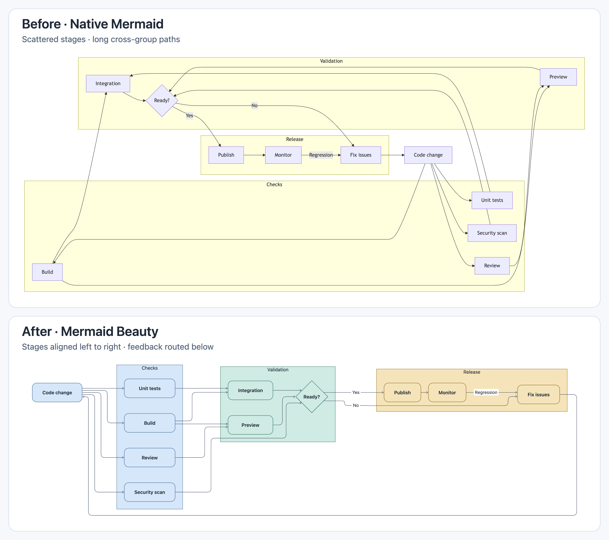

# Mermaid Beauty

Clearer Mermaid diagrams in Obsidian. Works with your existing `mermaid` blocks, without editing the source.

[中文说明](README.zh-CN.md)

This release workflow is reorganized into **Checks → Validation → Release**, with equal-width cards in each layer, fewer connector bends, and feedback routed below the main flow. All 11 nodes and 16 connections are preserved.

Both use the **[same Mermaid source](tests/browser/readme-sources.ts)** at the same scale: native Mermaid 11.13.0 with its default Dagre layout above, Mermaid Beauty with automatic ELK layout and the default Fresh palette below. No manual positioning or coloring. Click the image to enlarge.

## Install

Requires **Obsidian 1.12.7+**. Open **Settings → Community plugins → Browse**, search for **Mermaid Beauty**, then install and enable it. [Community listing](https://community.obsidian.md/plugins/mermaid-beauty)

### Manual installation

1. Download `main.js`, `manifest.json`, and `styles.css` from the [latest release](https://github.com/theChildinus/mermaid-beauty/releases/latest).
2. Put all three files in `<vault>/.obsidian/plugins/mermaid-beauty/`.
3. Reload Obsidian and enable **Mermaid Beauty**.

## Adjust the appearance

Open **Settings → Mermaid Beauty**:

- **Colors:** Fresh, Cool, and Natural coordinated palettes, single-hue presets, or custom colors. Follows Obsidian's light or dark theme.
- **Size and layout:** adjust text size, connector width, corners, spacing, and fit-to-width.
- **Per diagram type:** share defaults, use a separate style, or keep native rendering. Supports flowcharts, sequences, class diagrams, mind maps, charts, and more.

New installations use coordinated colors. Upgrades keep your existing appearance; choose **Default appearance → Color style → Coordinated colors** to try it.

## Notes

- Rendering runs locally. Diagram text is not uploaded; images linked in the source may need a network connection.
- Explicit source styles take precedence. If another plugin also replaces Mermaid rendering, disable one of them if they conflict.
- The bundled renderer is about **5.9 MB**, above Obsidian Sync Standard's 5 MB file limit. Install separately on each device. Mobile devices have not been tested.

[MIT License](LICENSE) · [Third-party notices](THIRD_PARTY_LICENSES.md)
