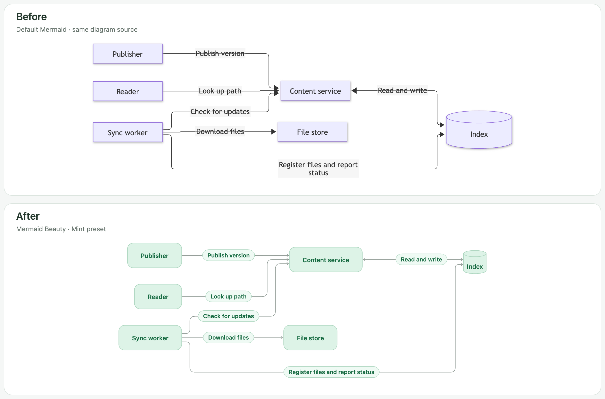
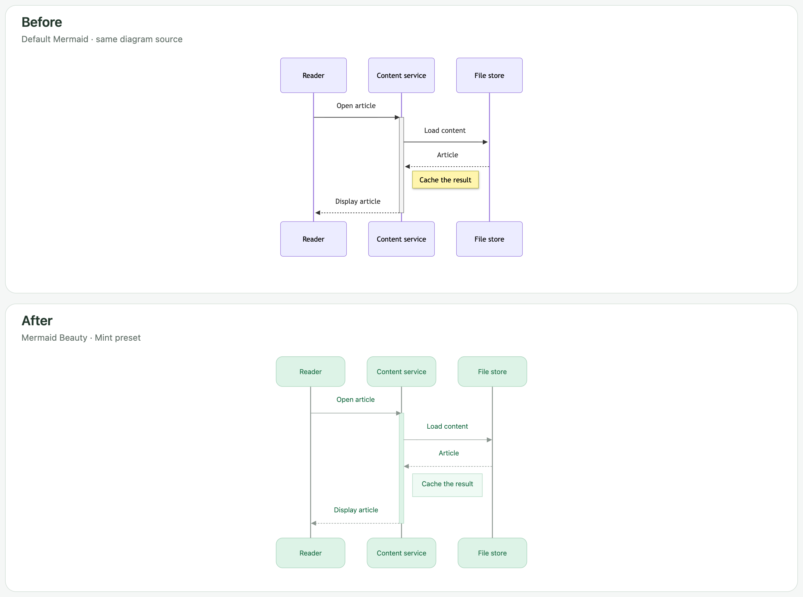
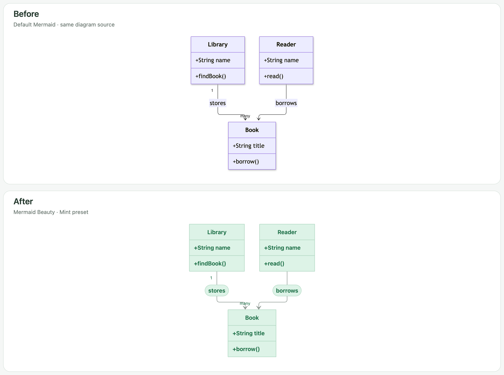

# Mermaid Beauty

Mermaid Beauty 为 Obsidian 中的 Mermaid 图统一配色、字体、线条和矩形圆角。所有支持的图类型默认启用增强渲染，也可以按类型选择独立样式或恢复原有渲染器。

默认的薄荷绿配色、胶囊边标签和流程图布局参考了 Codex 的视觉效果。插件使用公开的 Mermaid 引擎和自行编写的主题；字体、图类型和布局参数不同，结果可能与 Codex 有差异。

## 使用前后对比

每组图片使用同一份英文 Mermaid 源码和相同画布宽度。**Before** 使用 Mermaid 12 的默认主题、布局及 SVG 文字标签；**After** 使用 Mermaid Beauty 的薄荷绿预设。Obsidian 主题和 Mermaid 版本可能改变默认效果。

### 流程图



### 时序图



### 类图



[查看英文示例源码](dev/readme-examples.ts)

流程图节点按文字长度决定宽度，并保留纵向留白；胶囊标签先测量再布局，减少换行和拥挤。折线采用更舒展的圆角，箭头使用细线样式。

## 安装

需要 Obsidian 1.12.7 或更高版本。社区市场收录前，可从 [GitHub Releases](https://github.com/theChildinus/mermaid-beauty/releases) 下载 `main.js`、`manifest.json` 和 `styles.css`，放入笔记库的 `.obsidian/plugins/mermaid-beauty/` 目录，然后重新加载 Obsidian，在第三方插件设置中启用 Mermaid Beauty。

安装后，原有的 `mermaid` 代码块会使用增强渲染。请关闭其他会接管 Mermaid 渲染器的插件，避免设置相互覆盖。

## 设置

在 **设置 → Mermaid Beauty** 中调整全局配色、字号、圆角、间距和宽度适配。在 **Customize colors** 中选择浅色或深色模式，可用取色器或十六进制色值分别设置背景、节点、标签、文字、边框、连线和强调色。渲染时跟随 Obsidian 的明暗模式。

薄荷绿、灰蓝、天蓝和玫瑰四套预设可作为自定义的起点。切换 **Color preset** 会重置当前样式在两种模式下的自定义颜色；**Reset colors** 可清除颜色覆盖。

需要单独调整一种图时，在 **Diagram types** 中选择类型，再选择渲染方式：

| 选项 | 行为 |
| --- | --- |
| Inherit defaults | 使用全局样式，默认启用增强渲染。 |
| Enhanced, with custom appearance | 为这种图单独设置样式，也可填写 Mermaid 配置 JSON。 |
| Existing renderer | 交给原有渲染器处理。 |

每种图可以只覆盖需要的颜色，其余继承全局设置；为该类型选择预设后，则使用独立调色盘。高级 JSON 和图内显式设置的优先级高于颜色控件。

例如，时序图可以单独设置参与者颜色和间距：

```json
{
  "themeVariables": {
    "actorBkg": "#e1effc",
    "actorTextColor": "#225c95"
  },
  "sequence": {
    "actorMargin": 80,
    "messageMargin": 40
  }
}
```

配置支持 `themeVariables` 和各图类型的 Mermaid 设置，不接受执行脚本、注入 CSS 或降低安全等级。图内 frontmatter 和节点样式对其显式指定的属性优先。

流程图等关系图默认使用 ELK 布局，也可选择 Dagre。时序图、甘特图、饼图等保留自身的布局方式。圆角只调整适用的矩形，不把判断菱形、数据库圆柱等语义图形改成普通卡片。

## 支持范围

插件内置完整的 Mermaid 12.0.0、ELK 和 ZenUML，覆盖流程图、时序图、类图、状态图、ER 图、甘特图、饼图、思维导图、时间线、用户旅程、Git 图、象限图、需求图、C4、Sankey、XY 图、块图、报文图、架构图、看板、雷达图、树状矩形图、Venn 图、语法铁路图、树形目录、Cynefin、泳道图、用例图、Agent flow、事件建模、鱼骨图和 Wardley 图。

不同图类型支持的样式参数不同。新增的 Mermaid 图类型需要通过插件更新提供。未知类型也会尝试增强渲染，失败后交给原有渲染器；如果语法本身有错，原有渲染器也可能失败。

## 使用边界

- 图在本地渲染，插件不上传笔记、收集遥测或在线下载渲染器。图中主动引用的外部图片仍受资源可用性影响。
- 源码不依赖 Node.js 或 Electron，移动端仍需真机验证。
- 大图会消耗更多内存，目前限制为 100,000 个源码字符、1,500 条图边。
- 插件通过 Obsidian 的 `loadMermaid().render` 接入。Obsidian 或其他渲染插件升级可能影响兼容性。

命令面板提供刷新图表和切换增强渲染两个命令。阅读视图会立即刷新；实时预览或其他插件缓存的图，可能需要切换一次阅读/编辑视图或重新打开笔记。关闭或卸载 Mermaid Beauty 会恢复之前的渲染器。

开发和验证命令见 [英文 README](README.md#development)。
